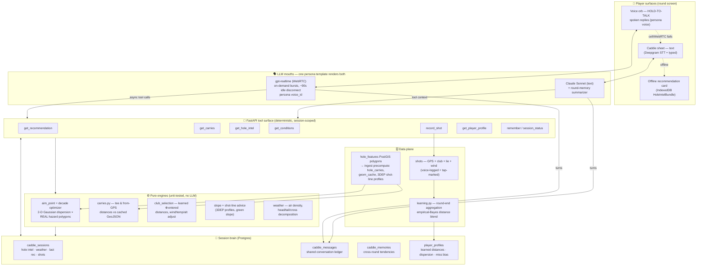

# Agentic Caddie — Architecture & Implementation Plan

## Context

The agentic caddie is the owner's stated **main focus** for Looper. Requirements: the caddie knows *my* distances and tendencies from shot history; uses map/course data, elevation, and wind; says where the miss is and where not to miss; gives carries over bunkers/hazards off the tee; runs DECADE course management; and lets me customize its style and voice (owner-confirmed: **voice-first shot logging** + **hold-to-talk with spoken replies**).

Recon found the decisive fact: **most of the brain already exists server-side but never reaches the player.** A DECADE expected-strokes optimizer (`backend/app/caddie/decade.py`), personal strokes-gained learning (`learning.py`), green-slope tactics, wind/air-density math (Open-Meteo), cross-round memory, session state, a persona system with voice ids, a GPS `shots` table, and a full OpenAI Realtime voice client all exist — while the live in-round UI calls the two dumbest stateless endpoints, the voice orb is a **hardcoded scripted demo** (`RoundPageClient.tsx:455-524`), and the persona id sent (`"steve"`) doesn't exist server-side, silently falling back to `classic`. The epic is chiefly wiring + completion, not greenfield.

## Architecture: "One brain, two mouths"

Deterministic engines are **tools**; LLMs only converse and orchestrate — they are forbidden from doing arithmetic ("never state a yardage, club, or carry you did not get from a tool"). One Postgres-backed round session is the durable brain; the WebRTC voice connection is an ephemeral burst, never the source of truth.

Key decisions (from design review):
- **Realtime lifecycle**: mint a WebRTC session on orb press, drop after ~90s idle; instructions rebuilt from session state per burst. Caps cost (chatty round ≪ $10) and makes flaky course cell a non-event.
- **Degradation ladder** (client `CaddieTransport` state machine): Realtime voice → Deepgram+Claude text sheet → offline cached recommendation card. Silent downgrades.
- **Carries are hybrid**: static per-(hole, tee) carries precomputed at ingest via PostGIS line/polygon intersection into a `hole_carries` table + simplified GeoJSON snapshots (`holes.geom_cache`); "from here" carries computed in pure Python against the cached GeoJSON (sub-ms, works offline). Un-mapped course → `available:false`, and the persona says "I don't have this course mapped" — **never fabricate**.
- **DECADE polygon upgrade**: `decade.optimize_aim` already takes a `ClassifyFn` — new `polygon_classify.py` swaps half-planes for real polygons (~4k point tests vs ~10 simplified polygons ≈ few ms); half-plane fallback stays for un-mapped courses.
- **Learned distances**: per club, last-40 quality shots, MAD outlier rejection, empirical-Bayes blend `w = n/(n+6)` with the user-entered number (50/50 at n=6; learned dominates by n=30; ±30% safety clamp). Learned σ replaces handicap-derived dispersion at n≥15; learned miss bias shifts the dispersion mean.
- **Persona consistency**: one persona record renders BOTH the Claude system prompt and the Realtime instructions from a single template; both mouths append to one message ledger. Keep both providers (Realtime = only production speech-to-speech; Claude = better/cheaper text+summaries).

## Phases (each = one TestFlight-noticeable bundle, full gates)

### P1 — Wire the existing brain
CaddieSheet → **session** endpoints (rich context: effective yards, hazards, slope, weather, memories, turns); round mount starts session + course-intel, finish ends it (memory + learning fire); persona list fetched from `GET /caddie/personalities` (kills the "steve"→classic bug); `/session/shot` dual-writes durable `Shot` rows so **voice-logged shots feed learning from day one**; read-only `GET /api/caddie/profile`. Files: `CaddieSheet.tsx`, `RoundPageClient.tsx`, `tokens.ts`/`lib/caddie/personalities.ts`, `routes/caddie.py`. No schema.

### P2 — Real voice (hold-to-talk orb)
Delete the scripted demo; wire `VoiceOrb` → `useRealtimeCaddie` (exists) with per-burst mint + idle disconnect; in-round mint builds instructions from persona + live session; tool surface v1 (`get_recommendation`, `record_shot`, `get_conditions`, `get_player_profile`, `get_carries` stub); `POST /session/message` shared ledger; new `lib/caddie/transport.ts` ladder + IndexedDB bundle. Files: `RoundPageClient.tsx`, `lib/voice/realtime.ts`, `routes/realtime.py`, `services/realtime_relay.py`, `routes/caddie.py`. `/security-review` (key minting).

### P3 — Course truth: carries + polygon DECADE
Ingest-time precompute (`osm_ingest.py`): `hole_carries` per (hole, tee, feature) + simplified `geom_cache` + 3DEP `shot_line_profile` (also fixes the never-firing `shot_line_advice`); new pure `polygon_classify.py` + `carries.py`; `course_intel` prefers stored polygons over live Overpass; real `get_carries(hole, from_gps?)` tool. Alembic `0010`. Bethpage-fixture validation tests.

### P4 — Learning v2: MY numbers
`learning.py` per-club distance/dispersion aggregation (blend policy above) → `player_profiles.club_distances_learned` (Alembic `0011`); `club_selection` blends + cites source ("your 8 has been flying 148"); learned σ/miss-bias into the DECADE dispersion; profile screen "what my caddie knows" card. Property test: learned never shifts effective distance >30%.

### P5 — Persona studio
Single trait template → both prompt formats (retro-fit 4 built-ins); persona picker + custom builder UI (name, traits, terse/chatty, distance pref, Realtime voice with 5s audible preview); injection-fenced user text; validate voice_id. `/security-review` (user-supplied prompts) + designer review.

Dependencies: P1 first (session substrate); P3 ∥ P4 after P2; shot capture ships in P1 because P4's quality compounds with data volume.

## Verification
- Per phase: `ruff` + full backend pytest; frontend `tsc`/lint/vitest/`voice-tests --smoke`/build; sim-boot check before TestFlight (per SIMTEST.md).
- Engine truth: fixture tests (Bethpage geometry, synthetic shot logs, hand-computed carries); DECADE polygon-vs-half-plane sanity (water short-right must push aim left).
- End-to-end: scripted session transcript test — start session → ask for a rec → log a shot by voice → end round → assert memory + learning aggregates wrote; on-course manual checklist in each PR for the owner.
- Reviews: `/security-review` P1/P2/P5; `/code-review` + designer agent on user-facing phases.

## Cost & risk envelope
Realtime audio ≈ $0.05–0.30/hole with hold-to-talk bursts; hard idle disconnect. Overpass/3DEP leave the hot path (ingest precompute). Un-mapped courses degrade honestly. Voice-logged distances are noisy → quality filters + shrinkage; GPS-marked shots sharpen the same pipeline. Persona prompt injection fenced. `CLAUDE.md` stale "no real DB" line gets fixed in P1.
